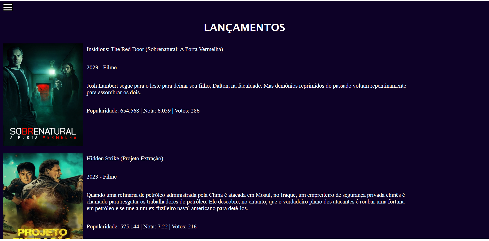
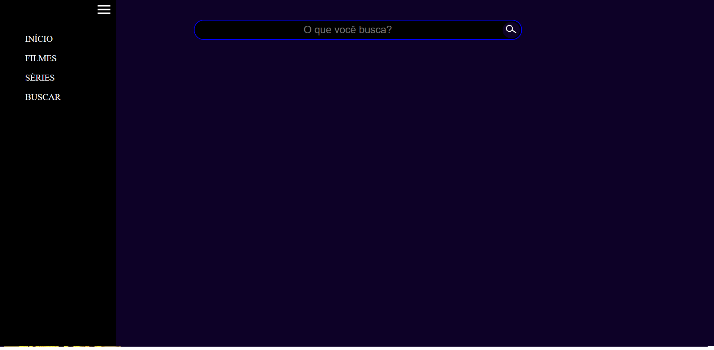

# Cinema

<label> 🎬 Descrição:

 Página usada para verificar sinopse e avaliação de outros usuários de filmes e séries atuais e antigos, com uso de API do site: https://developer.themoviedb.org/docs

<label> 🎬 Instalação e Execução:

<li> Para instalar em seu computador você precisa clicar no botão verde escrito 'Code' e em seguida selecionar a opção 'Download Zip'. Ou, se preferir:

<li> Para executar é necessário que você tenha alguma ferramenta de extração de arquivos, como a winRAR, para extrair a pasta para o local no seu computador
que você deseja ter acesso.

<label> 🎬 Uso da página: 

<li> Página inicial com filmes e séries em lançamento:

<li> Página de busca para filmes e séries e menu lateral para alterar página:

<li> Além de páginas com filmes e séries populares no momento.

<label> 🎬 Ferramentas Utilizadas:

